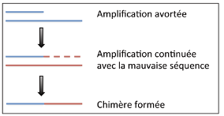

# beginning_obitools

**Franck Pichot, Bastien Macé, Agnès Duhamet, Pierre-Edouard Guerin 2020**

## Introduction

[OBITools](https://git.metabarcoding.org/obitools/obitools/wikis/home) are commands written in python, which can be used to analyse eDNA 
metabarcoding data based on sequencers using Illumina technology.

Here, we follow the [tutorial of obitools](https://pythonhosted.org/OBITools/wolves.html)

Only those which permit to make a pair-end sequencing and to demultiplex the sequences are presented here, in the aim to use the pipeline dada2 next.

## Preliminary steps

- First you need to have Anaconda installed

If it's not the case, click on this [link](https://www.anaconda.com/products/individual/get-started) and dowload it.

Install the download :
```
bash Anaconda3-2020.07-Linux-x86_64.sh
```

Then, close your shell and reopen it.
Verify conda is correctly installed. It should be here :
```
/~/anaconda3/bin/conda
```

Reopen your terminal and write the following line :
```
conda config --set auto_activate_base false
```

- Create your new environment obitools from your root beginning_obitools in your corresponding path. For example :
```
ENVYAML=./environnements/obitools_env_conda.yaml
conda env create -f $ENVYAML
```

Now you can activate your environment :
```
conda activate obitools
```
And deactivate it :
```
conda deactivate
```

- If necessary, download your data you want to analyse like in the following example :
```
curl https://pythonhosted.org/OBITools/_downloads/wolf_tutorial.zip -o wolf_tutorial.zip
unzip wolf_tutorial.zip
```

## Step 1 : Pair-end sequencing

Activate your environment :
```
conda activate obitools

```

Make a pair-end sequencing. From your forward and reverse fastq files, this command will create a new fastq file, which will contain the pair-end sequences whith their quality scores. At the end of this step, the forward and the reverse reads of the same fragment of the two fastq files will be assembled. This reconstructed sequence will be the result of an alignment of the two reads.

```

illuminapairedend --score-min=40 -r wolf_tutorial/wolf_R.fastq wolf_tutorial/wolf_F.fastq > wolf.fastq

## --score-min doesn't take into account the sequences with a low quality score (below 40 here). 

```

If the alignment score is below the chosen threshold then the forward and the reverse reads will not be aligned. Here with example, (below 40) the probability of an error is 0,0001. They will be annotaded as "joined" and they will be remove during the second step. Trimming increase the quality and the reliability of the sequences.


To only conserve the pair-end sequences we have to eliminate the sequences which haven't been aligned :

```
obigrep -p 'mode!="joined"' wolf.fastq > wolf.ali.fastq
## -p requires a python expression
## the unaligned sequences are notified in the header sequence with mode="joined" whereas the aligned sequences are notified with mode="aligned" 
## python create a new dataset which only contains the sequences notified "aligned"
```

## Step 2 : Demultiplexing

After building the amplicon sequence, each of them must be assigned to its initial PCR according to the tag added at one or both extremities of the amplified sequence. Each tag attached directly to the 5'-end of one or both primers must have the same lenght. Sequence demultiplexing detect the amplification primer associated with the tag. After that, the central metabarcode sequence will be extracted and assigned to its corresponding PCR. During this step a file will be generate. In this file each sequence is tagged with the sample name. 

```
ngsfilter -t wolf_tutorial/wolf_diet_ngsfilter.txt -u unidentified.fastq wolf.ali.fastq > wolf.ali.assigned.fastq
```

Two files, containing the sequences deprived of their tag, are created. In this example :
- unidentified.fastq contains the sequences that were not assigned with a correct tag
- wolf.ali.assigned.fastq contains the sequences that were assigned with a correct tag, in other words, it contains only the barcode sequences

Each sequence header with an attribute named "count" containing the occurence of the reads is annotated.

## Step 3 : Dereplicate reads into uniq sequences

On DNA metabarcoding, the same sequence occurs many times. With the aim to reduce the size of the dataset, all identical sequences will be group with their associated information. This process consist in a clustering operation with an identity threshold of 100%. 

```
obiuniq -m sample wolf.ali.assigned.fastq > wolf.ali.assigned.uniq.fasta
```

 The -m option alllows to dereplicate the sequence data set all in keeping the number of occurences of each unique sequence in each PCR. To keep only these two key value attributes we use obiannotate

```
 obiannotate -k count -k merged_sample \
  wolf.ali.assigned.uniq.fasta > $$ ; mv $$ wolf.ali.assigned.uniq.fasta
```

## Step 4 : Denoising the sequence dataset

All the sequences without biological interest need to be removed. That could be sequences containing PCR and/or sequencing errors, or chimeras. The first step consist in discarting rare sequences. Obistat can count the "count attribute" added previously by obiuniq and then discard rare sequences. 

```
obistat -c count wolf.ali.assigned.uniq.fasta |  \
  sort -nk1 | head -20
```


